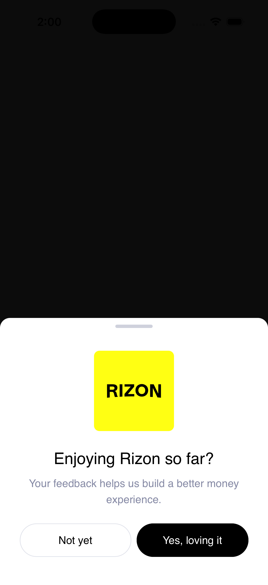

# Onboarding Bottom Sheets - React Native App

A production-ready React Native mobile application featuring three sequential onboarding bottom sheets with best practices in architecture, state management, and UI/UX design.

## Architecture

This project follows a **feature-based modular architecture** with clear separation of concerns:

```
/src
  /components        # Reusable UI elements (Button, CustomInput)
  /navigation        # React Navigation setup
  /redux             # Redux Toolkit slices and store
  /screens           
    /BottomSheets    # OnboardSheet, FeedbackSheet, ReviewSheet
    HomeScreen.tsx   # Main application screen
  /services          # API communication layer
  /utils             # Helpers, hooks, constants
  /assets            # Images, icons
```

## Tech Stack

- **React Native** 0.83.1 - Cross-platform mobile framework
- **TypeScript** - Type safety and improved DX
- **React Navigation** - Navigation management
- **Redux Toolkit** - State management
- **@gorhom/bottom-sheet** - High-performance bottom sheets
- **React Native Gesture Handler** - Native-driven gesture handling
- **React Native Reanimated** - Smooth 60fps animations
- **Axios** - HTTP client for REST API calls
- **Kotlin** (Android) & **Swift** (iOS) - Native code integration

## Features

### Three Onboarding Bottom Sheets

1. **Welcome Sheet** - Appears after initial onboarding completion
   - Triggered by backend onboarding status
   - Shows welcome message and introduction
   - Dismissible via "Get Started" button

2. **Feedback Sheet** - Appears after welcome sheet
   - Custom input component with character counter
   - Backend API integration for feedback submission
   - Race condition prevention for API calls
   - "Send Feedback" or "Skip for Now" options

3. **Review Sheet** - Final onboarding step
   - Platform-specific store redirects (App Store / Google Play)
   - Deep linking to store pages
   - "Rate Now" or "Maybe Later" options

### Architecture Highlights

- **State Management**: Redux Toolkit with typed hooks
- **API Layer**: Centralized service classes with interceptors
- **Type Safety**: Full TypeScript coverage
- **Performance**: Optimized animations on main thread
- **Modular Design**: Easy to extend and maintain
- **Error Handling**: Comprehensive try-catch with user feedback

### Customization

**Colors & Styling**:
Modify `/src/utils/constants.ts` to adjust app-wide colors and spacing.

**Bottom Sheet Behavior**:
Each bottom sheet component can be customized:
- Snap points
- Backdrop opacity
- Handle indicator style
- Pan gesture behavior

## Testing

The app includes a debug section on the Home screen with a "Reset Onboarding Flow" button for testing the complete sheet sequence without backend integration.

## Key Implementation Details

### Race Condition Prevention

The `FeedbackSheet` uses a ref to prevent race conditions:
```typescript
const isSubmittingRef = useRef(false);
```
This ensures the API request completes before closing the sheet.

### State Flow

```
Backend Check → Redux Store → Custom Hook → Sheet Display
```

1. `useOnboardingFlow` hook checks backend status
2. Redux state updated based on response
3. Appropriate sheet displays automatically
4. User actions update Redux state
5. Next sheet displays in sequence

### Performance Optimizations

- Memoized callbacks to prevent unnecessary re-renders
- Lazy loading of bottom sheets
- Optimized gesture handling with native driver
- Minimal re-renders with proper React patterns

## Contributing

This codebase follows:
- ESLint configuration for code quality
- Prettier for code formatting
- TypeScript strict mode
- Feature-based folder structure

## Output:




